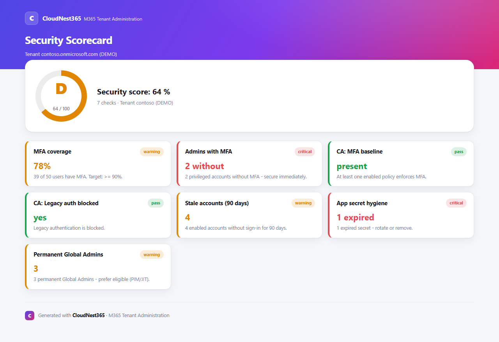
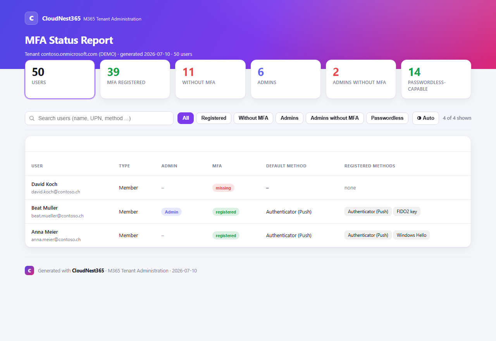
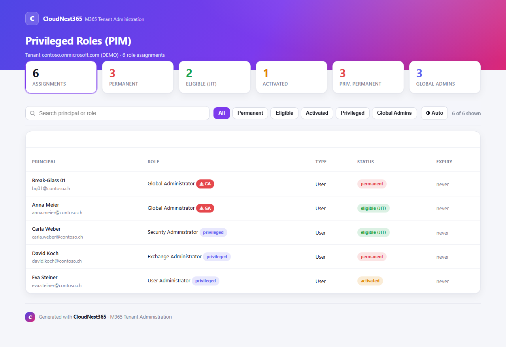
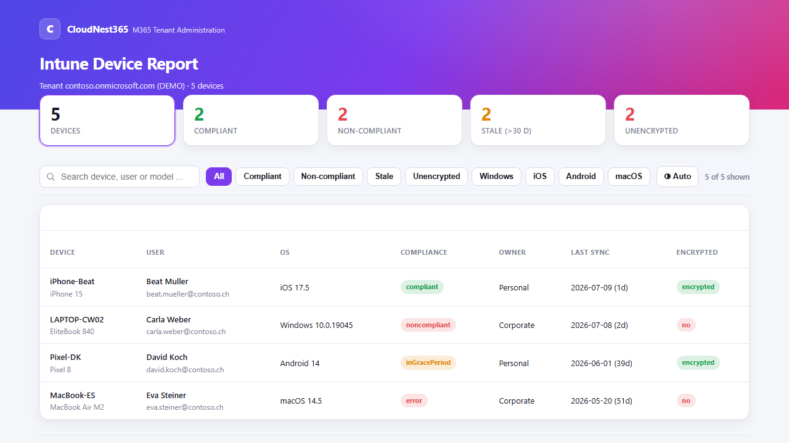
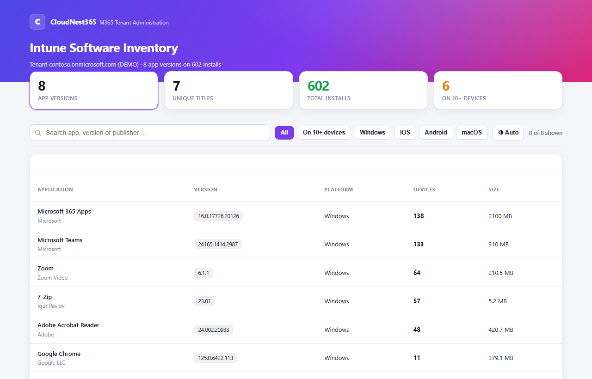
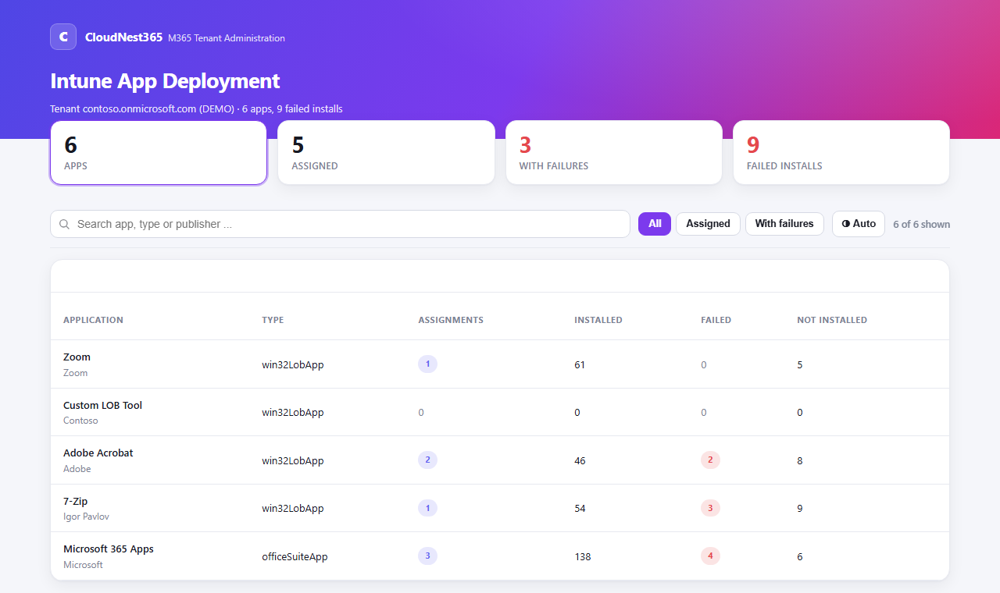
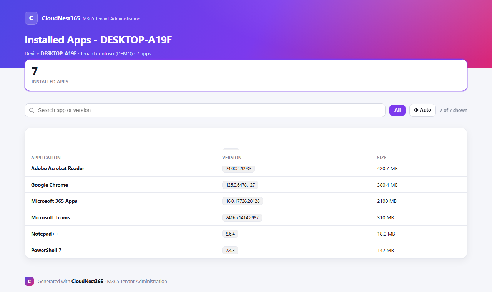

<div align="center">

# 🧰 TenantToolbox

**A gallery of small, sharply-scoped PowerShell cmdlets for Microsoft 365 tenant administration.**
Each cmdlet does exactly *one* job — with a unified auth/log/`-WhatIf` frame and beautiful, interactive HTML reports.

[](LICENSE)
[](https://learn.microsoft.com/powershell/)
[](https://learn.microsoft.com/graph/)
[](https://github.com/CloudNest365/TenantToolbox/actions)

*by [CloudNest365](https://github.com/CloudNest365)*

</div>

---

> ⚠️ **Note:** Free for **non-commercial** use with attribution — redistribution/modification not allowed. See [License](#-license).
> 🔒 Reports contain real tenant data. Generated output (`*.html/.csv/.xlsx/.json`) is in `.gitignore` — please **never commit it**.

## ✨ Highlights

- **11 cmdlets** — from stale accounts through MFA & PIM to app secrets.
- **Interactive HTML reports** — live search, filters, sorting, light/dark theme, collapsible cards — all self-contained (no CDN, works offline).
- **Security Scorecard** with an overall grade **A–F** across MFA, Conditional Access, stale accounts and app secrets.
- **Data export** to CSV/Excel and **change tracking** via CA snapshots.
- **Branding** — every report customizable via `-BrandName`.

## 📸 Screenshots

| Security Scorecard | MFA Status |
|---|---|
| [](assets/scorecard.png) | [](assets/mfa.png) |

| Privileged Roles (PIM) | Intune Devices |
|---|---|
| [](assets/pim.png) | [](assets/intune.png) |

| Intune Software Inventory | Intune App Deployment |
|---|---|
| [](assets/intuneapp.png) | [](assets/deployment.png) |

**Per-device app drilldown** — every app installed on a single device:

[](assets/deviceapp.png)

<sub>Screenshots use demo data.</sub>

## 📦 Requirements

```powershell
Install-Module Microsoft.Graph      -Scope CurrentUser   # required
Install-Module ImportExcel          -Scope CurrentUser   # optional, for -Excel
```

PowerShell 7+.

## 🚀 Getting started

```powershell
git clone https://github.com/CloudNest365/TenantToolbox.git
Import-Module ./TenantToolbox/TenantToolbox.psd1

# Sign in (most robust in the VS Code terminal):
Connect-TenantToolbox -UseDeviceCode -LogPath ./tenanttoolbox.log

# Read-only:
Get-M365StaleUsers -InactiveDays 90 | Format-Table
Export-M365SecurityScorecard -BrandName 'CloudNest365'

# State-changing action — always dry-run first:
Invoke-M365Offboarding -User marta@contoso.ch -WhatIf
```

## 🧩 Cmdlets

| Cmdlet | Purpose | Changes state? |
|---|---|---|
| `Connect-TenantToolbox` | Auth (WAM / device code / browser) + log path | – |
| `Get-M365StaleUsers` | Find inactive / never-signed-in users | no |
| `Get-M365MfaStatus` | MFA / registration status of all users (objects) | no |
| `Get-M365TenantSummary` | Colored console overview of the tenant's posture | no |
| `Invoke-M365Offboarding` | Leaver chain (Entra + Exchange + OneDrive) | **yes** (`-WhatIf`) |
| `Remove-M365StaleGuests` | Find & remove inactive guest accounts | **yes** (`-WhatIf`) |
| `Backup-M365ConditionalAccess` | Back up CA policies as a JSON snapshot | no |
| `Compare-M365Snapshot` | Compare two snapshots → HTML diff | no (local) |
| `Export-M365ConditionalAccessReport` | CA policies with impact hints | no |
| `Export-M365MfaReport` | MFA status (table, admins-without-MFA) | no |
| `Export-M365AppSecretReport` | Expiring/expired app secrets & certificates | no |
| `Export-M365SecurityScorecard` | Overall grade A–F across multiple signals | no |
| `Export-M365PimReport` | Privileged roles: permanent vs. eligible vs. activated | no |
| `Get-M365IntuneDevice` | Intune-managed devices (objects) | no |
| `Export-M365IntuneDeviceReport` | Intune devices: compliance, sync, encryption | no |
| `Get-M365IntuneApp` | Detected software inventory (objects) | no |
| `Export-M365IntuneAppReport` | Software inventory: app, version, device count | no |
| `Get-M365IntuneAppDeployment` | App assignment & install status (objects) | no |
| `Export-M365IntuneAppDeploymentReport` | App deployment: assigned / installed / failed | no |
| `Get-M365IntuneDeviceApp` | Apps installed on a single device (objects) | no |
| `Export-M365IntuneDeviceAppReport` | Per-device app drilldown | no |
| `Remove-M365StaleDevices` | Find & delete stale Intune devices | **yes** (`-WhatIf`) |

Full docs in the **[Wiki](https://github.com/CloudNest365/TenantToolbox/wiki)**.

## 📤 Data export (CSV / Excel)

Every `Export-*` report and `Compare-M365Snapshot` can additionally export the raw data:

```powershell
Export-M365MfaReport -Csv              # HTML + CSV
Export-M365PimReport -Excel            # HTML + XLSX (needs ImportExcel)
Export-M365PimReport -Excel -NoHtml    # XLSX only
Export-M365MfaReport -NoHtml           # CSV only (format chosen automatically)
```

- `-Csv` · `-Excel` · `-DataPath <path>` · `-NoHtml`
- If `ImportExcel` is missing, `-Excel` falls back to CSV automatically.

## 🔐 Required Graph permissions

Read-only for all reports: `Directory.Read.All`, `Policy.Read.All`, `Application.Read.All`,
`UserAuthenticationMethod.Read.All`, `RoleManagement.Read.Directory`, `AuditLog.Read.All`.
Only `Invoke-M365Offboarding` needs write permissions. Details in [SECURITY.md](SECURITY.md).

## 🗺️ Roadmap

- `Remove-M365StaleGuests` – clean up orphaned guests
- `Export-M365GuestReport` – guest overview
- `Get-M365TenantSummary` – colored console overview
- Certificate auth for unattended runs
- PIM check in the Scorecard

Ideas? → [Feature request](https://github.com/CloudNest365/TenantToolbox/issues/new/choose)

## 🤝 Contributing

See [CONTRIBUTING.md](CONTRIBUTING.md) and the [Code of Conduct](CODE_OF_CONDUCT.md).
Please respect the license limits (no commercial use, no redistribution).

## 📄 License

**Creative Commons BY-NC-ND 4.0** — free for non-commercial use with attribution.
No commercial use, no redistribution of modified versions. Details: [LICENSE](LICENSE).

For commercial use, please contact CloudNest365.

---

<div align="center"><sub>© 2026 CloudNest365 · TenantToolbox</sub></div>
